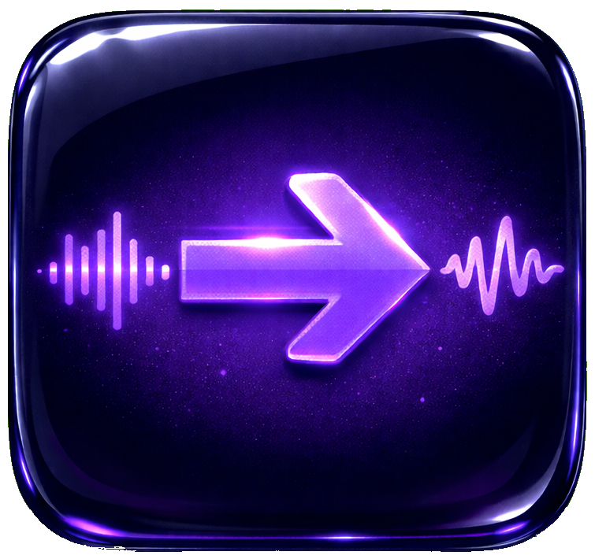

# MTO — Mp3ToOgg

<div align="center">



**A free audio converter and YouTube downloader built for My Winter Car.**

[](https://github.com/morkulaarttu/MTO/releases)
[](https://github.com/morkulaarttu/MTO/releases)
[](license)

</div>

---

## What is MTO?

MTO (Mp3ToOgg) is a free Windows tool that lets you add any YouTube song directly to your My Winter Car radio — just paste a link and MTO downloads, converts, and saves it to your Radio folder automatically.

It also supports converting your own MP3 files. Tracks are automatically named `track1.ogg`, `track2.ogg` and so on, always picking the next free slot without overwriting anything. Your My Winter Car Radio folder is auto-detected via Steam.

---

## Features

- **MP3 → OGG conversion** with automatic track numbering
- **Source / Destination split** — convert from anywhere, save directly to My Winter Car Radio
- **Auto-detects My Winter Car** via Steam library scan
- **YouTube downloader** — paste a link, get a track file
- **Download queue** — add multiple links and let it run
- **Video preview** before downloading
- **Conversion history** log
- **Select & reorder** files before converting
- **Conversion speed** slider — Low / Normal / High CPU usage
- **Windows notifications** when jobs finish
- **Settings tab** — theme, accent color, language, font size, update management
- **Dark & light theme** with accent color picker
- **9 languages** — English, Finnish, Swedish, German, French, Spanish, Chinese, Japanese, Korean
- **Minimize to system tray**
- **Auto-updater** — checks GitHub for new releases on startup
- **First-run tutorial** — interactive walkthrough on first launch
- **No manual setup** — FFmpeg and yt-dlp install automatically on first launch

---

## Download

Get the latest release from the [Releases page](https://github.com/morkulaarttu/MTO/releases).

Download `MTO.zip`, extract it, and run `MTO.exe` — no installation required.

> **First launch:** MTO will automatically download FFmpeg (~70 MB) and yt-dlp (~10 MB) from GitHub. This only happens once.

> **SmartScreen warning:** Click "More info" → "Run anyway". This warning appears because the app does not have a paid code signing certificate, not because it is dangerous.

---

## Requirements

- Windows 10 or 11
- Internet connection (first launch only, for FFmpeg + yt-dlp)
- My Winter Car on Steam (for auto-detection — optional)

---

## Building from Source

**Install dependencies:**
```bash
pip install -r requirements.txt
```

**Build with Nuitka (recommended — obfuscated):**
```bash
python -m nuitka --onefile --windows-console-mode=disable --windows-icon-from-ico=logo.ico --output-filename=MTO.exe --output-dir=dist --enable-plugin=tk-inter --nofollow-import-to=tkinter.test --assume-yes-for-downloads app.py
```

**Or build with PyInstaller (simpler):**
```bash
python -m PyInstaller --onefile --windowed --name "MTO" --icon "logo.ico" --clean app.py
```

Place `logo.ico` in the same folder as `app.py` before building.

You can also use the included `build.bat` which handles everything automatically.

---

## Usage

### Converting MP3s

1. Under **SOURCE**, select the folder containing your MP3 files
2. Under **DESTINATION**, MTO auto-fills your My Winter Car Radio folder — or select it manually
3. Choose which files to convert using the checkboxes
4. Reorder with ↑↓ if needed
5. Press **Start Conversion**

### Downloading from YouTube

1. Go to the **YouTube** tab
2. Paste a video or playlist URL
3. Press **Fetch Info** to preview before downloading
4. Press **+ Add to Queue** to queue multiple links
5. Select your destination folder
6. Press **Download**

---

## Logs

MTO writes log files to:
```
C:\Users\<you>\AppData\Roaming\MP3toOGG\logs\MTO.log
```

Log files rotate automatically and never exceed 1 MB each. If something goes wrong, this file will help diagnose the issue.

---

## License

Copyright © 2026 @MorkulaArttu.

Licensed under the **GNU General Public License v3**. See [LICENSE](license) for full terms.

---

<div align="center">
Made by <a href="https://github.com/morkulaarttu">@MorkulaArttu</a>
</div>
